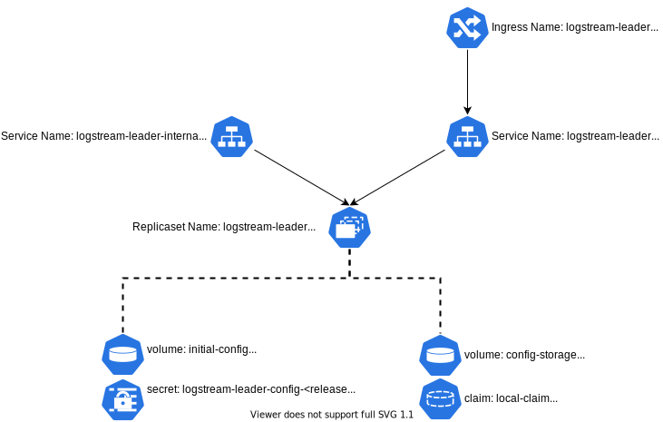

# logstream-leader Helm Chart

This Chart deploys a Cribl Stream Leader instance.

# Important Note

This chart is the replacement for the `logstream‑master` chart, which has been deprecated.
If you're migrating from the deprecated `logstream‑master` chart, please see the [Migration](#migration) Section.

# New Capabilities

* Support for the 4.7.1 version of Cribl Stream (default version)

# Deployment

As built, this chart will deploy a Cribl Stream Leader server, consisting of a deployment, two services, and a number of persistent volumes. 



Note: Two load-balanced services are created – the main one (named after the Helm release), which is intended as the primary service interface for users; and the "internal" one (named `<helm-release>-internal`), which is intended for the workergroup-to-leader communication.

# <span id="pre-reqs"> Prerequisites </span>

## Helm Setup

1. Helm (preferably v3) installed – instructions are [here](https://helm.sh/docs/intro/install/).
1. Cribl helm repo configured. To do this:
	`helm repo add cribl https://criblio.github.io/helm-charts/`

## Persistent Storage

The chart requires persistent storage; it will use your default storage class, or you can override that class (`config.scName`) with the name of a storage class to use. We tested this primarily using AWS EBS storage, via the CSI EBS driver. The volumes are created as `ReadWriteOnce` claims. For more info on Storage Classes, see the [Kubernetes.IO Storage Classes page](https://kubernetes.io/docs/concepts/storage/storage-classes/).

## AWS-Specific Notes

If you're running on EKS, see the [EKS-Specific Issues](../../common_docs/EKS_SPECIFICS.md) doc for details.

# Values to Override

This section covers the most likely values to override. To see the full scope of values available, run `helm show values cribl/logstream-leader`. 

|Key|Default Value (or type)|Description|
|---|----|-------------|
|config.adminPassword|String|The password you want the admin user to have set.|
|config.token|String|The auth key you want to set up for worker access. The Cribl Stream instance is configured as a distributed leader server only if this value is set. (This can, of course, also be configured via the Cribl Stream UI.) |
|config.license|String|The license for your Cribl Stream instance. If you do not set this, it will default to the "free" license. You can change this in the Cribl Stream UI as well.|
|config.bindHost|`0.0.0.0`|IP address or DNS name to bind for API. Can set to `::1` for IPv6 environments.|
|config.groups| [] |The group names to configure for the leader instance – this will create a mapping for each group, which looks for the tag `<groupname>`, and will create the basic structure of each group's configuration.|
|config.scName|\<default storage class\>|The StorageClass Name for all of the persistent volumes.|
|config.rejectSelfSignedCerts|0|0 – allow self-signed certs; or 1 – deny self-signed certs. |
|config.probes|true|Perform health checks on the Leader pod. Recommended that this be enabled to automatically restart the Leader if the Pod is unhealthy.|
|config.livenessProbe|see `values.yaml`|[livenessProbe](https://kubernetes.io/docs/tasks/configure-pod-container/configure-liveness-readiness-startup-probes/#define-a-liveness-http-request) configuration|
|config.readinessProbe|see `values.yaml`|[readinessProbe](https://kubernetes.io/docs/tasks/configure-pod-container/configure-liveness-readiness-startup-probes/#define-readiness-probes) configuration|
|service.internalType|ClusterIP|The type to use for the `<release>-leader-internal` service. In 2.4.5 and beyond, this is set to ClusterIP by default. If you have any workergroups outside of the kubernetes cluster where the leader lives, you'll need to change this to NodePort or LoadBalancer to expose it outside of the cluster.|
|service.internalLoadBalancerIP|none (IP Address)|The IP address to use for the load balancer service interface, if the internalType is set to LoadBalancer. Check with your Kubernetes setup to see if this is supported. |
|service.externalType|LoadBalancer|The type to use for the user facing `<release>-leader` service. If ingress.enable is set, this will be force set to NodePort, to work with the ingress.| 
|service.externalLoadBalancerIP|none (IP Address)|The IP address to use for the load balancer service interface, if the externalType is set to LoadBalancer. Check with your Kubernetes setup to see if this is supported. |
|service.ports|[]|<pre>- name: api<br>  port: 9000<br>  protocol: TCP<br>  external: true<br>- name: leadercomm<br>  port: 4200<br>  protocol: TCP<br>  external: false</pre>|The ports to make available both in the Deployment and the Service. Each "map" in the list needs the following values set: <dl><dt>containerPort</dt><dd>the port to be made available</dd><dt>name</dt><dd>a descriptive name of what the port is being used for</dd><dt>protocol</dt><dd>the protocol in use for this port (UDP/TCP)</dd><dt>external</dt><dd>Set to true to be exposed on the external service, or false not to</dd></dl>|
|service.annotations|{}|Annotations for the service component – this is where you'll want to put load-balancer-specific configuration directives.|
|criblImage.tag|3.4.0|The container image tag to pull from. By default, this will use the same version as the chart release, but you can also use version tags (like "3.3.1") to pull specific versions of Cribl Stream. |
|consolidate_volumes|boolean|If this value exists, and the `helm` command is `upgrade`, this will use the split volumes that we created in charts before 2.4 and consolidate them down to one config volume. This is a ONE-TIME event.|
|nodeSelector|{}|Add nodeSelector values to define which nodes the pods are scheduled on - see [k8s Documentation](https://kubernetes.io/docs/concepts/scheduling-eviction/assign-pod-node/) for details and allowed values. |
|__Extra Configuration Options__|
|[persistence](../../common_docs/EXTRA_EXAMPLES.md#persistence)| See `values.yaml`|Persistence configuration for Leader configuration files.|          
|[extraVolumeMounts](../../common_docs/EXTRA_EXAMPLES.md#extraVolumeMounts)|{}|Additional volumes to mount in the container.|
|[extraSecretMounts](../../common_docs/EXTRA_EXAMPLES.md#extraSecretMounts)|[]|Pre-existing secrets to mount within the container. |
|[extraConfigmapMounts](../../common_docs/EXTRA_EXAMPLES.md#extraConfigmapMounts)|{}|Pre-existing configmaps to mount within the container. |
|[extraInitContainers](../../common_docs/EXTRA_EXAMPLES.md#extraInitContainers)|{}|Additional containers to run ahead of the primary container in the pod.|
|[extraContainers](../../common_docs/EXTRA_EXAMPLES.md#extraContainers)|{}|Additional containers to run as sidecars of the primary container in the pod.|
|[securityContext.runAsUser](../../common_docs/EXTRA_EXAMPLES.md#securityContext)|"0"|User ID to run the container processes under. Must be a string.|
|[securityContext.runAsGroup](../../common_docs/EXTRA_EXAMPLES.md#securityContext)|"0"|Group ID to run the container processes under. Must be a string.|
|[envValueFrom](../../common_docs/EXTRA_EXAMPLES.md#extraEnvFrom)|{}|Environment variables to be exposed from the Downward API.|
|[env](../../common_docs/EXTRA_EXAMPLES.md#env)|[]|Additional static environment variables.|
|ingress.enable|false|Enable Ingress in front of the external service. Setting this to `true` changes the external service to type `NodePort`, and creates an ingress that connects to it.|
|ingress.annotations|{}|If `ingress.enable` is set to `true`, this is where you'll want to put annotations to configure the specific ingress controller. _*NOTE: Ingress is supported only on Kubernetes 1.19 and later clusters*_. |
|ingress.tls|{}|[Ingress TLS configuration](https://kubernetes.io/docs/concepts/services-networking/ingress/#tls)|
|ingress.ingressClassName|none|Override the default ingress class ([added in Kubernetes 1.18](https://kubernetes.io/docs/concepts/services-networking/ingress/#deprecated-annotation))|
|ingress.path|`/*`|The Ingress path Prefix|

# Basic Installation

* To  install the chart with the release name "logstream-leader":

  `helm install logstream-leader cribl/logstream-leader`


* To install the chart using the storage class "ebs-sc"

  `helm install logstream-leader cribl/logstream-leader --set config.scName='ebs-sc'`
  
# Post-Install/Post-Upgrade

Cribl Stream will not automatically deploy changes to the worker nodes. So you'll need to go into the Cribl Stream UI and [commit and deploy changes](https://docs.cribl.io/stream/deploy-distributed) for all of your worker groups. 

# Cribl Stream Configuration Overrides

The Helm chart, without any values overrides, creates a Single-Instance deployment of Cribl Stream, using the standard container image. You can, if you so choose, configure a Distributed mode, licensing, admin user passwords, etc., all from the Cribl Stream UI. However, you can install the chart with value overrides to achieve the same goals.

* Applying a License

  If you have a Standard or Enterprise license, you can add it as an override to your install using the `config.license` parameter:

  `helm install logstream-leader cribl/logstream-leader --set config.license="<long encoded license string redacted>"`
  
* Running Distributed on a Free License

  If you are not specifying a license, you'll need to go into the Cribl Stream user interface and accept the free license. You can configure the Leader in Distributed mode, by using the chart's `config.groups` option. If you don't, it will be configured as Cribl Stream Single-Instance mode. You can change this configuration in Cribl Stream's UI.

* Setting the admin password

  Normally, when you first install Cribl Stream and log into the UI, it forces you to change your password. You can skip that by setting your admin password via the `config.adminPassword` parameter:

  `helm install logstream-leader cribl/logstream-leader --set config.adminPassword="<new password>"`

* Setting up Worker Groups/Mappings

  As mentioned above, the default is to install a vanilla deployment of Cribl Stream. If you are deploying as a Leader, you can use the `config.groups` parameter to define the worker groups you want created and mapped. Each group in the list you provide will be created as a worker group, with a mapping rule to look for a tag with the worker group name in it. Here is an example:

  `helm install logstream-leader cribl/logstream-leader --set config.groups={group1,group2,group3}`

  That command will create three worker groups: `group1`, `group2`, and `group3`, and a mapping rule for each.

# <a name=migration></a>Migrating from the logstream-master Chart

## Exporting your Configuration
You'll need to "export" your data from the existing logstream-master pod. First, you'll need to get the current pod's name, as well as its namespace. The easiest way to do this is to run `kubectl get pods -A` and look pods that start with the release name you used when you ran helm install. For example, if you installed with the following command:

`helm install ls-master cribl/logstream-master`

You'd look for a pod name that started with `ls-master`.

Once you've identified your pod and namespace, you can export your configuration using a combination of kubectl and tar:

```
kubectl exec <pod name> -n <namespace> -- bash -c "cd /opt/cribl/config-volume; tar cf - ." > cribl_backup.tar
```

This command executes the tar based back up of the config-volume, and outputs it to a local tar file (cribl_backup.tar).

## "Re-Hydrating" the Backup on the logstream-leader Chart

Exploding the tarball onto the new persistent volume is a one time event. Once the config-volume is restored, you'll make changes to the config via the Cribl Stream UI or API, causing the config on disk to change, which you wouldn't want to overwrite the next time the Pod restarts. You can do this manually by installing the logstream-leader chart, and then running the following command:

```
cat cribl_backup.tar| kubectl -n <namespace> exec --stdin <pod name> -- bash -c "cd /opt/cribl/config-volume/; tar xf -"
```

This will restore the data into the config volume (which is mounted as `/opt/cribl/config-volume`). If you want to double-check that, run:

```
kubectl -n <namespace> exec <pod name> -- bash -c "ls -alR /opt/cribl/config-volume"
```

After this, you want to *delete* the active pod, allowing the new one to come up with the restored configuration. To do this, you'd run the following kubectl command:

```
kubectl -n <namespace> delete <pod name>
```

This will cause the pod to exit, but the deployment will replace it with a new pod which will use the same config persistent volume.

## Reconfiguring the Worker Groups

Now that you've got a new working leader chart, you need to tell the workers to connect to the new leader instead of the old `logstream-master` instance. This is a simple `helm upgrade` operation. You'll need to use the same command string that you used to install (changing the word "install" to "upgrade"), but changing the value of `config.host` (either via the --set option or in the values.yml file) with the new service that was created for the logstream-leader install. For example, if you ran the `logstream-leader` install with the release name `ls-lead`, like this:

`helm install ls-lead -f <values file> cribl/logstream-leader`

you'd run `kubectl get service -n <namespace> | grep ls-lead` to get the two services it created, and you'll want the name of the one that ends in `-internal`. In this case, that name would be `ls-lead-leader-internal`.

If, for your workergroup install, you used a release name of `ls-wg1`, and a values file named `my-values.yml` with the following contents:

```
config:
  host: logstream-master-internal
  group: kubernetes
  token: criblmaster
  rejectSelfSignedCerts: 0
```

then you'd replace the value for host with `ls-lead-leader-internal` in the file, and then run:

`helm upgrade ls-wg1 -f my-values.yml -n <namespace>`

The upgrade *should* replace all the existing workergroup pods with newly reconfigured ones, but if you notice any workergroup pods with an AGE value that indicates it was started before the upgrade command, simply kill those pods, and they will respawn with the new configuration. 

# Preloading Configuration

The advent of the `extraConfigmapMounts` [](../../common_docs/EXTRA_EXAMPLES.md#extraConfigmapMounts) and `extraSecretMounts` [](../../common_docs/EXTRA_EXAMPLES.md#extraSecretMounts) options provides the ability to "preload" configuration files into the leader chart, via ConfigMaps and Secrets that you've created in your Kubernetes environment. However, with Configmaps and Secret Mounts being read-only – both *can* be made writeable, but the K8s docs recommend against it – you can't simply mount them into the configuration tree. They need to be mounted to a location outside of the `/opt/cribl` tree, and then the files must be copied into the tree at startup. This copying can be accomplished using environment variables, as we'll see below. 

## Configuration Locations

The chart creates a single configuration volume claim, `config-storage`, which gets mounted as `/opt/cribl/config-volume`. All Worker Group configuration lives under the `groups` subdirectory. If you have a worker group named `datacenter_a`, its configuration will live in `/opt/cribl/config-volume/groups/datacenter_a`. See the Cribl Stream docs' [Configuration Files](https://docs.cribl.io/stream/configuration-files/) section for details on file locations.

## <span id="env-vars"> Using Environment Variables to Copy Files </span>

The cribl container's `entrypoint.sh` file looks for up to 30 environment variables assumed to be shell-script snippets to execute before Cribl Stream startup (`CRIBL_BEFORE_START_CMD_[1-30]`). It also looks for up to 30 environment variables to execute after Cribl Stream startup (`CRIBL_AFTER_START_CMD_[1-30]`). 

The variables in each set need to be in order, and cannot skip a number. (The `entrypoint.sh` script breaks the loop the first time it doesn't find an env var, so if you have `CRIBL_BEFORE_START_CMD_1` skipping to `CRIBL_BEFORE_START_CMD_3`, then `CRIBL_BEFORE_START_CMD_3` will not be executed.)

The chart uses this capability to inject the license and to set up groups. We'll use this same capability to copy our config files into place. So if you've provided the `config.license` and `config.groups` variables (occupying the first two slots), you'll need to start with `CRIBL_BEFORE_START_CMD_3`. In the examples below, we'll start with `CRIBL_BEFORE_START_CMD_3`, assuming that a `config.license` and `config.groups` have been set. 

### Figuring Out Which Variable to Use

The easiest way to figure out which environment variable you need to use is to deploy the chart with all the options you plan to use (i.e., to use the `helm install` command with options that you plan to use for your deployment). Then check the pod definition for `CRIBL_*` environment variables. For example, if you used the following install command:

```
% helm install lsms -f ../leader-values.yaml -n logstream-ht cribl/logstream-leader
```

You can now get the pod's name: 

```
% kubectl get pods -n logstream-ht
NAME                                           READY   STATUS    RESTARTS   AGE
lsms-leader-659bfccdd6-xsz67                   1/1     Running   0          52m
```

And then you can use `kubectl describe` to get the relevant environment variables:

```
% kubectl describe  pod/lsms-leader-659bfccdd6-xsz67 -n logstream-ht  | egrep "CRIBL_.*START"
CRIBL_BEFORE_START_CMD_1:      if [ ! -e $CRIBL_VOLUME_DIR/local/cribl/licenses.yml ]; then mkdir -p $CRIBL_VOLUME_DIR/local/cribl ; cp /var/tmp/config_bits/licenses.yml $CRIBL_VOLUME_DIR/local/cribl/licenses.yml; fi
CRIBL_BEFORE_START_CMD_2:      if [ ! -e $CRIBL_VOLUME_DIR/local/cribl/mappings.yml ]; then mkdir -p $CRIBL_VOLUME_DIR/local/cribl;  cp /var/tmp/config_bits/groups.yml $CRIBL_VOLUME_DIR/local/cribl/groups.yml; cp /var/tmp/config_bits/mappings.yml $CRIBL_VOLUME_DIR/local/cribl/mappings.yml; fi
CRIBL_AFTER_START_CMD_1:       [ ! -f $CRIBL_VOLUME_DIR/users_imported ] && sleep 20 && cp /var/tmp/config_bits/users.json $CRIBL_VOLUME_DIR/local/cribl/auth/users.json && touch $CRIBL_VOLUME_DIR/users_imported
```

From that, you can tell that we already have a `CRIBL_BEFORE_START_CMD_1` and `CRIBL_BEFORE_START_CMD_2`, so our next logical variable should be `CRIBL_BEFORE_START_CMD_3`. 

## Preloading Scenario

Here's a preload scenario that includes a sample ConfigMap, `extraConfigmapMounts`, copy command, and copy-once flag.

### The ConfigMap
Let's say we want to preconfigure a collector job in the `group1` worker group. The job will be called `InfrastructureLogs`, and it will read ELB logs from an S3 bucket. First, we'll need a `jobs.yml` file, like this:

```
InfrastructureLogs:
  type: collection
  ttl: 4h
  removeFields: []
  resumeOnBoot: false
  schedule: {}
  collector:
    conf:
      signatureVersion: v4
      enableAssumeRole: true
      recurse: true
      maxBatchSize: 10
      bucket: <my infrastructure logs bucket>
      path: /ELB/AWSLogs/${aws_acct_id}/elasticloadbalancing/${aws_region}/${_time:%Y}/${_time:%m}/${_time:%d}/
      region: us-west-2
      assumeRoleArn: arn:aws:iam::<accountid>:role/LogReadAssume
    destructive: false
    type: s3
  input:
    type: collection
    staleChannelFlushMs: 10000
    sendToRoutes: false
    preprocess:
      disabled: true
    throttleRatePerSec: "0"
    breakerRulesets:
      - AWS Ruleset
    pipeline: devnull
    output: devnull
```

We'll need this loaded into a ConfigMap object, so we'd run kubectl to create a ConfigMap from the directory where our `jobs.yml` file resides:

`kubectl create configmap job-config --from-file <containing directory> -n <deployment namespace>`

So if that file is in a directory called `./config-dir`, and we're deploying the leader chart into the `logstream` namespace, we'd create it like this:

`kubectl create configmap job-config --from-file ./config-dir -n logstream`

### extraConfigmapMounts Config

In our `values.yaml` file, we need to specify the ConfigMap and where to mount it:

```
extraConfigmapMounts:
  - name: job-config
    configMap: job-config
    mountPath: /var/tmp/job-config
```

This example will mount the files in the ConfigMap into the pod's `/var/tmp/job-config` directory. 

### Copying the Config Files

You could simply define, in the `values.yaml` file (or via `--set`):

```
env:
  CRIBL_BEFORE_START_CMD_3: "cp /var/tmp/job-config /opt/cribl/config-volume/groups/group1/local/cribl/jobs.yml"
```

However, there are two potential problems with that:
1. There is no guarantee that the destination directory tree will be there. (The first time a pod spins up, it won't be.)
2. If the pod has crashed and spun up anew, blindly copying will overwrite any changes previously made. This is rarely desirable behavior.

#### File Copying Pattern

Since we might want to copy multiple configuration files in one shot, it makes sense to use some sort of "flag file" to ensure that we copy the files only once. The script snippet to copy the `jobs.yaml` file looks like this, formatted for readability:

```
FLAG_FILE=/opt/cribl/config-volume/job-flag
if [ ! -e $FLAG_FILE ]; then
  mkdir -p /opt/cribl/config-volume/groups/group1/local/cribl # ensure the directory tree exists
  cp /var/tmp/job-config/jobs.yml /opt/cribl/config-volume/groups/group1/local/cribl # copy the file
  touch $FLAG_FILE
fi
```

This looks to see if the file `/opt/cribl/config-volume/job-flag` exists, and if it doesn't, creates the directory tree, copies the config file(s), and then creates the job flag file. However, we need to format it a little differently to easily encompass it in the `env` variable:

```
env: 
  CRIBL_BEFORE_START_CMD_3: "FLAG_FILE=/opt/cribl/config-volume/job-flag; if [ ! -e $FLAG_FILE ]; then mkdir -p /opt/cribl/config-volume/groups/group1/local/cribl; cp /var/tmp/job-config/jobs.yml /opt/cribl/config-volume/groups/group1/local/cribl; touch $FLAG_FILE; fi"
```

Once you run `helm install` with this in the `values.yaml` file, you can do `kubectl exec` on the pod to execute a shell:

`kubectl exec -it <pod name> -- bash`

...and then look at `/opt/cribl/config-volume/groups/group1/local/cribl/jobs.yml` to verify that it is in place. 

# Caveats/Known Issues

* [EKS-Specific Issues](../../common_docs/EKS_SPECIFICS.md).

# More Info

For additional documentation on this chart, see the [Cribl Docs](https://docs.cribl.io/stream/deploy-kubernetes-leader) page about it.

# Feedback/Support

If you use this Helm chart, we'd love to hear any feedback you might have. Join us on our [Slack Community](https://cribl.io/community) and navigate to the `#kubernetes` channel.
