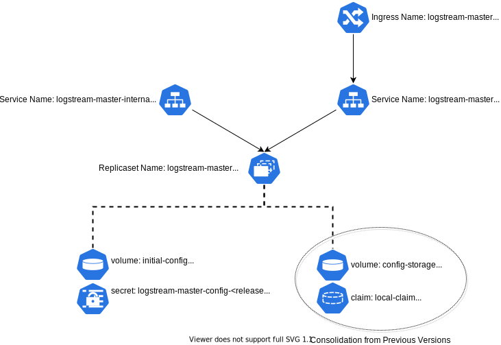

# logstream-workergroup Helm Chart

This Chart deploys a Cribl LogStream worker group.

# DISCLAIMER

This chart is **EXPERIMENTAL** at this point. Use it at your own risk!

# Deployment

As built, this chart will deploy a Cribl LogStream Master Server, consisting of a deployment, two services, and a number of persistent volumes. 



# Pre-Requisites

1. Helm (preferably v3) installed - instructions are [here](https://helm.sh/docs/intro/install/)
1. Cribl helm repo configured. To do this:
	`helm repo add cribl https://criblio.github.io/helm-charts/`

# Values to Override

This section covers the most likely values to override. To see the full scope of values available, run `helm show values cribl/logstream-master`. 


|Key|Type|Default Value|Description|
|---|----|-------------|-----------|
|config.scName|String|default storage class|the StorageClass Name for all of the persistent volumes.|
|config.rejectSelfSignedCerts|Number|0|0 - allow self-signed certs, 1 - deny self-signed certs|
|config.healthPort|number|9000|the port to use for health checks (readiness/live)|
|service.ports|Array of Maps|<pre>- name: api<br>  port: 9000<br>  protocol: TCP<br>  external: true<br>- name: mastercomm<br>  port: 4200<br>  protocol: TCP<br>  external: false</pre>|The ports to make available both in the Deployment and the Service. Each "map" in the list needs the following values set: <dl><dt>containerPort</dt><dd>the port to be made available</dd><dt>name</dt><dd>a descriptive name of what the port is being used for</dd><dt>protocol</dt><dd>the protocol in use for this port (UDP/TCP)</dd><dt>external</dt><dd>Set to true to be exposed on the external service, or false not to</dd></dl>|
|service.annotations|String|None|Annotations for the the service component - this is where you'll want to put load balancer specific configuration directives|
|image.tag|String|latest|The container image tag to pull from. By default this will use the latest release, but you can also use version tags (like "2.3.2") to pull specific versions of LogStream|


## EKS Specific Values
In the case of an EKS deployment, there are many annotations that can be made for the load balancer. Internally, we usually use the annotations for logging to S3, like this:

```
    service.beta.kubernetes.io/aws-load-balancer-access-log-enabled: "true"
    service.beta.kubernetes.io/aws-load-balancer-access-log-emit-interval: "5"
    service.beta.kubernetes.io/aws-load-balancer-access-log-s3-bucket-name: "<bucket name>"
    service.beta.kubernetes.io/aws-load-balancer-access-log-s3-bucket-prefix: "ELB"
```

for a fairly exhaustive lists of annotations you can use with AWS's Elastic Load Balancers, see the [Kubernetes Service](https://kubernetes.io/docs/concepts/services-networking/service/) page.

# Install


* To  install the chart with the release name "logstream-master":

 `helm install logstream-master cribl/logstream-master`

  (if you're doing it from a local git clone, do: `helm install logstream-master <path to git clone/helm-chart-sources/logstream-master>`)

* To install the chart using the storage class "ebs-sc"

 `helm install logstream-master cribl/logstream-master --set config.scName='lebs-sc`


# Feedback

If you use this helm chart, we'd love to hear any feedback you might have on this chart. Join us on our [Slack Community](https://cribl.io/community) in the #kubernetes channel.
